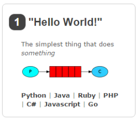
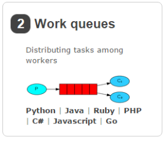
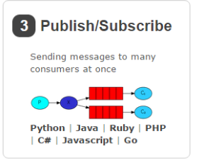
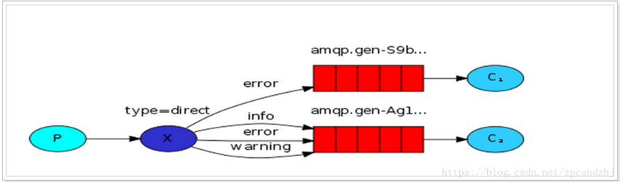
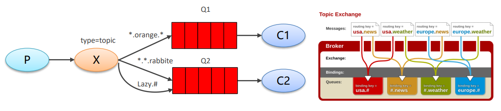

# RabbitMQ的工作模式
**图示信息:**
P: 生产者
C: 消费者
红色: 队列
## 1. "Hello world" 简单模式
* 生产者发送消息，消费者接受消息

## 2. "Work queues" 工作流模式
* 具有两个消费端共同消费同一个队列中的消息(竞争关系)
* 一个消息只会被一个消费者接收
* rabbit采用轮询的方式将消息平均发送给消费者
* 消费者是在处理完某条消息之后才会收到下一条消息
* 应用场景：
  * 对于任务过重或任务较多的情况使用工作队列可以提高任务处理的速度
  * 对于任务过重或任务较多情况使用工作队列可以提高任务处理的速度。例如：短信服务部署多个，
    只需要有一个节点成功发送即可。

## 3. "Publish/Subscribe" 订阅模式
* 每个消费者监听自己的队列
* 生产者将消息发给 broker ，由交换机将消息转发到绑定此交换机的每个队列，
  每个绑定交换机的队列都将接受到消息
* 生产者，也就是要发送消息的程序，但是不再发送到队列中，而是发给X(交换机)
* C: 消费者，消息的接收者，会一直等待消息到来
* Queue: 消息队列，接收消息、缓存消息
* Exchange: 交换机(X)。一方面，接收生产者发送的消息。另一方面，知道如何处理消息，例如:
  递交给某个特别队列、递交给所有队列、或是将消息丢弃。到底如何操作，取决于Exchange的类型。Exchange有常见以下3种类型:
  * Fanout: 广播，将消息交给所有绑定到交换机的队列
  * Direct: 定向，把消息交给符合指定routing key 的队列
  * Topic: 通配符，把消息交给符合routing pattern (路由模式) 的队列
* **Exchange (交换机)只负责转发消息，不具备存储消息的能力，因此如果没有任何队列与 Exchange 绑定，或者没有符合
  路由规则的队列，那么消息会丢失!**

## 4. "Routing" 路由模式
* 队列与交换机绑定，不能是任意绑定了，而是要指定一个RoutingKey(路由key)
* 消息的发送方向在向Exchange发送消息时，也必须指定消息的RoutingKey
* Exchange不再把消息交给每一个绑定的队列，而是根据消息的Routing Key
  进行判断，而只有队列的RoutingKey与消息的Routing Key完全一致，才会接收到消息。
* **图解：**
  * P：生产者，向 Exchange 发送消息，发送消息时，会指定一个routing key
  * X：Exchange（交换机），接收生产者的消息，然后把消息递交给与 routing key 完全匹配的队列
  * C1：消费者，其所在队列指定了需要 routing key 为 error 的消息
  * C2：消费者，其所在队列指定了需要 routing key 为 info、error、warning 的消息

## 5. "Topics"主题模式(通配符模式)
* Topic 类型与 Direct 相比，都是可以根据 RoutingKey 把消息路由到不同的队列。只不过 Topic 类型
 Exchange 可以让队列在绑定 Routing key 的时候使用通配符！
* Routingkey 一般都是有一个或多个单词组成，多个单词之间以”.”分割，例如： item.insert
* 通配符规则：# 匹配一个或多个词，* 匹配不多不少恰好1个词，例如：item.# 能够匹配 item.insert.abc
   或者 item.insert，item.* 只能匹配 item.insert
* **图解**
  * 红色 Queue：绑定的是 usa.# ，因此凡是以 usa. 开头的 routing key 都会被匹配到
  * 黄色 Queue：绑定的是 #.news ，因此凡是以 .news 结尾的 routing key 都会被匹配

# Springboot整合RabbitMQ
rabbitmq-springboot-producer 生产者
rabbitmq-springboot-consumer 消费者
## 四中交换机介绍
* **DirectExchange(直连交换机)：** 具有路由功能的交换机，绑定到此交换机的时候需要指定一个routing_key，交换机发送消息的时候需要routing_key，会将消息发送道对应的队列
* **FanoutExchange(扇形交换机)：** 广播消息到所有队列，没有任何处理，速度最快
* **TopicExchange(主题交换机，通配符形式)：** 在直连交换机基础上增加模式匹配，也就是对routing_key进行模式匹配，*代表一个单词，#代表多个单词
* **HeadersExchange(首部交换机)：** 忽略routing_key，使用Headers信息（一个Hash的数据结构）进行匹配，优势在于可以有更多更灵活的匹配规则